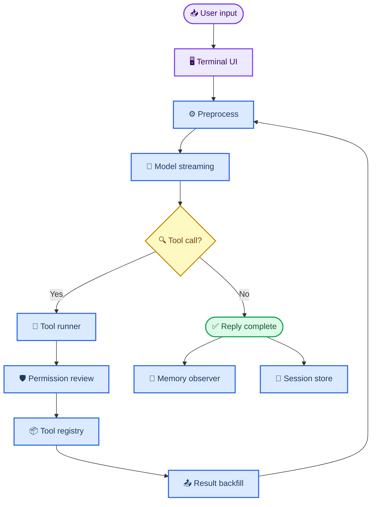

# code_agent

_一个从零开始搭建的本地 Python Coding Agent，用来实验 Agent 主循环、工具系统、长期记忆和上下文管理。_

<p align="center">
  
</p>

<p align="center">
  <a href="https://github.com/Anorlx/code_agent"></a>
  
  
  
</p>

## 🧭 项目定位

`code_agent` 不是一个只包了一层 API 的聊天脚本，而是一个逐步拆出来的本地 Agent 实验场。它目前围绕一个 terminal 入口运行：用户输入任务，主 Agent 通过 LangGraph 状态机推进对话，按需选择工具，交给子 Agent 执行，再把结果回填给主模型继续判断。

这个仓库适合用来记录和展示：

- 一个 Coding Agent 的主循环如何从普通 `while` 演进到 `StateGraph`
- 工具选择、权限审查、工具执行和结果回填如何拆层
- 长期记忆、会话历史和上下文压缩如何接入真实对话
- 一个本地 terminal Agent 如何保持流式输出和可观察状态

## ✨ 功能亮点

| 模块 | 作用 | 关键文件 |
| --- | --- | --- |
| Terminal 入口 | 会话选择、流式输出、事件展示、退出前 flush | `main.py`, `agent/main_agent/cli.py`, `agent/main_agent/terminal_ui.py` |
| LangGraph 主循环 | `preprocess -> api_call -> tool_execution -> result_backfill` | `agent/main_agent/graph.py` |
| 工具系统 | 文件读写、项目搜索、命令执行、时间、计算、记忆工具 | `agent/tools/registry.py`, `agent/tools/*.py` |
| 子 Agent | 工具选择、权限审查、工具运行、记忆写入、会话摘要 | `agent/sub_agent/*.py` |
| 长期记忆 | Markdown 记忆文件、索引、TTL、去重和冲突覆盖 | `agent/memory_system/*.py`, `memory/` |
| 上下文管理 | Snip、MicroCompact、Collapse、AutoCompact | `agent/main_agent/context_manager.py` |
| 会话历史 | SQLite 保存 messages，启动时可继续历史会话 | `agent/main_agent/session_store.py` |

## 🖼️ 架构预览

<p align="center">
  
</p>



## 🚀 快速开始

```bash
git clone https://github.com/Anorlx/code_agent.git
cd code_agent
export DASHSCOPE_API_KEY="你的 DashScope API Key"
python3 main.py
```

当前项目还没有提交独立的 `requirements.txt` 或 `pyproject.toml`。如果你在新环境里运行，需要先补齐代码中用到的依赖，例如 `langgraph`、`prompt_toolkit` 和 DashScope/OpenAI-compatible 客户端相关包。

## 🧪 使用体验

启动后会先进入会话选择界面，可以新建会话，也可以继续之前的历史会话。正式对话时，terminal 会显示更干净的事件流：

```text
code_agent> 帮我看一下这个项目结构
state / tools ls_project,read_project_file
tool_call ls_project path=.
tool_done ls_project done
token dashscope in=... out=... total=...
```

主 Agent 拿到工具结果后不会立刻结束，而是继续判断是否需要再调用工具，或者直接给出最终回答。

## 🧠 设计取向

- **本地优先**：会话、记忆、日志和工具工作区都在仓库本地
- **小步演进**：每一层能力都尽量拆成可读的小模块
- **可观察**：状态、工具调用、上下文压缩和 token 用量都会在 terminal 中展示
- **可扩展**：工具注册表、子 Agent 和 LangGraph 节点都可以继续加能力

## 🗺️ 当前路线

- [x] Terminal 对话入口
- [x] LangGraph 主循环
- [x] 工具选择与工具执行
- [x] 权限审查子 Agent
- [x] SQLite 会话历史
- [x] 长期记忆系统
- [x] 上下文压缩与 snip 工具
- [ ] 整理依赖安装文件
- [ ] 接入更多 MCP / 外部工具
- [ ] 补充更系统的端到端示例

## 📌 仓库说明

这个 README 是仓库首页介绍，也就是 `Anorlx/code_agent` 根目录的项目门面。更细的工具目录说明放在 `agent/tools/README.md`，开发日志和具体实现细节会继续沉淀到对应模块文档里。
