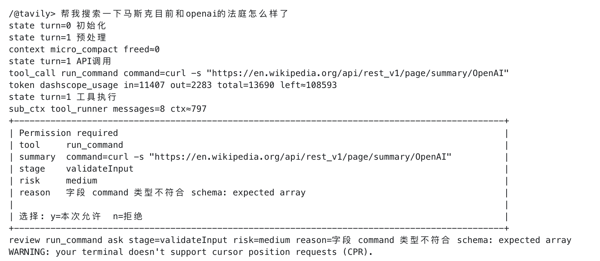

# code_agent

_一个本地 Python Coding Agent：把 LangGraph 主循环、工具系统、上下文管理、长期记忆和 MCP 接入组织成清晰的 Agent 工程。_

<p align="center">
  
</p>

<p align="center">
  <a href="https://github.com/Anorlx/code_agent"></a>
  
  
  
</p>

## 🧭 这个仓库是什么

`code_agent` 是一个本地 terminal coding agent。它把用户输入、记忆检索、工具选择、权限审查、工具执行、结果回填和会话保存串成一条可观察的运行链路。

根目录的 README 是整个项目的总入口，重点介绍当前 Agent 架构和主要模块。

## 🧠 当前主线理解

当前版本可以拆成三条清晰的线：

- **主 Agent 线**：`chat_loop` 收到用户输入，加载相关记忆，然后把任务交给 `run_agent`
- **图执行线**：LangGraph 在 `preprocess -> api_call -> tool_execution -> result_backfill` 之间循环，直到没有工具调用
- **支撑系统线**：工具权限、会话保存、记忆检索/写入、上下文压缩都在主循环外侧支撑长期运行

<p align="center">
  
</p>

## 🔁 一轮对话怎么跑


## ✨ 模块分工

| 模块 | 它解决的问题 | 关键文件 |
| --- | --- | --- |
| Terminal 层 | 用户输入、会话选择、流式事件展示、权限确认、退出前等待后台任务 | `agent/main_agent/cli.py`, `agent/main_agent/terminal_ui.py` |
| LangGraph 主循环 | 把 Agent 状态拆成可路由节点，避免所有逻辑堆在一个 `while` | `agent/main_agent/graph.py` |
| 工具选择 | 根据当前问题和工具目录，决定本轮暴露哪些工具给主模型 | `agent/sub_agent/tool_search.py`, `agent/tools/README.md` |
| 工具执行 | 构造子 Agent 短上下文、校验 schema、审查权限、必要时请求用户确认、并发执行只读工具 | `agent/sub_agent/tool_runner.py`, `agent/sub_agent/permission_review.py` |
| 工具注册表 | 统一管理工具 schema、执行函数、并发安全和审查要求 | `agent/tools/registry.py` |
| 上下文管理 | Snip、MicroCompact、Collapse、AutoCompact，减少旧工具结果占用 | `agent/main_agent/context_manager.py` |
| 长期记忆 | 只保存不可低成本推导的信息，并支持 TTL、score、冲突覆盖 | `agent/memory_system/store.py`, `agent/memory_system/observer.py` |
| 会话历史 | SQLite 保存完整 messages，并用摘要帮助下次选择会话 | `agent/main_agent/session_store.py`, `agent/sub_agent/session_summarizer.py` |
| 模型适配 | DashScope OpenAI-compatible 流式输出，合并 tool call fragments | `agent/main_agent/model_client.py` |
| MCP 接入 | 从 `.mcp.json` 发现 stdio MCP server，把远端 tool 注册成普通工具并复用权限管线 | `agent/mcp`, `.mcp.json`, `mcp-servers/` |

## 🚀 快速开始

```bash
git clone https://github.com/Anorlx/code_agent.git
cd code_agent
export DASHSCOPE_API_KEY="你的 DashScope API Key"
python3 main.py
```

## 🧪 终端体验

运行后会先选择会话，然后进入 `code_agent>`。一次任务里你可以看到这些事件：

```text
state / tools ls_project,read_project_file
tool_call read_project_file path=agent/main_agent/graph.py
review read_project_file allow risk=low
tool_done read_project_file path=agent/main_agent/graph.py
token dashscope_usage in=... out=... total=...
context micro_compact freed≈...
```

这些事件不是装饰，它们对应真实的运行边界：主图状态、工具调用、权限审查、工具结果、模型 token 用量和上下文清理。

## 🛡️ 权限确认管线

工具执行前的安全路径拆成四步：

1. `validateInput`：根据工具 schema 检查必需字段、类型和枚举值
2. `hasPermissionsToUseTool`：读取工具配置，处理 `deny` 和 `requires_review`
3. `checkPermissions`：由 `permission_review` 子 Agent 根据短上下文判断风险
4. `interactivePrompt`：当结果是 `ask` 时，把决定权交还给 terminal 用户

这样一来，参数不合法、规则要求确认、上下文风险较高这三类情况都会走同一条路径：不静默执行，也不让主模型自己硬猜。

<p align="center">
  
</p>

上面这个例子里，模型想调用 `run_command` 执行联网查询，但传入的 `command` 不是工具 schema 要求的数组格式。系统在 `validateInput` 阶段把它标记为 `ask`，展示风险等级、阶段和原因，再由用户选择本次允许或拒绝。

## 🔌 MCP 接入方式

项目根目录使用 `.mcp.json` 管理 MCP server，`agent/mcp/settings.json` 管理权限策略。MCP 工具会被注册成 `mcp__server__tool`，然后和普通工具一样经过 `tool_search -> function schema -> tool_runner -> permission_review -> interactivePrompt`。

当前本地先接入了两个 stdio MCP：

- `amap-maps`：高德地图能力，例如地址解析、路线规划、天气和地点搜索。
- `tavily`：联网搜索能力，例如搜索、网页提取、站点地图发现和网页爬取。

因为 `.mcp.json` 里包含 API key，它已经加入 `.gitignore`，不要上传到 GitHub。Terminal 中输入 `/@` 可以选择 MCP server；也可以直接输入 `/@amap-maps ...` 或 `/@tavily ...` 强制本轮优先使用指定 MCP。

## 📌 设计取向

- **本地优先**：会话、记忆、日志和工具工作区都在项目本地
- **主循环清晰**：LangGraph 只处理状态流转，工具执行和权限判断下沉到子 Agent
- **记忆克制**：只保存无法从代码、文件或 Git 重新推导的信息
- **可观察**：每一步都尽量通过 terminal 事件暴露出来
- **模块清楚**：主 Agent、子 Agent、工具、记忆和 MCP 各自有明确边界
