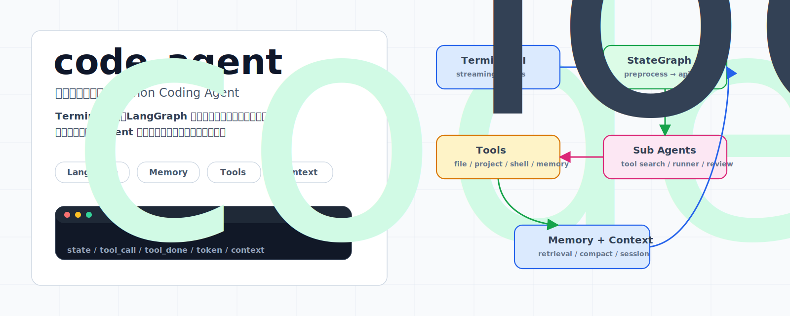
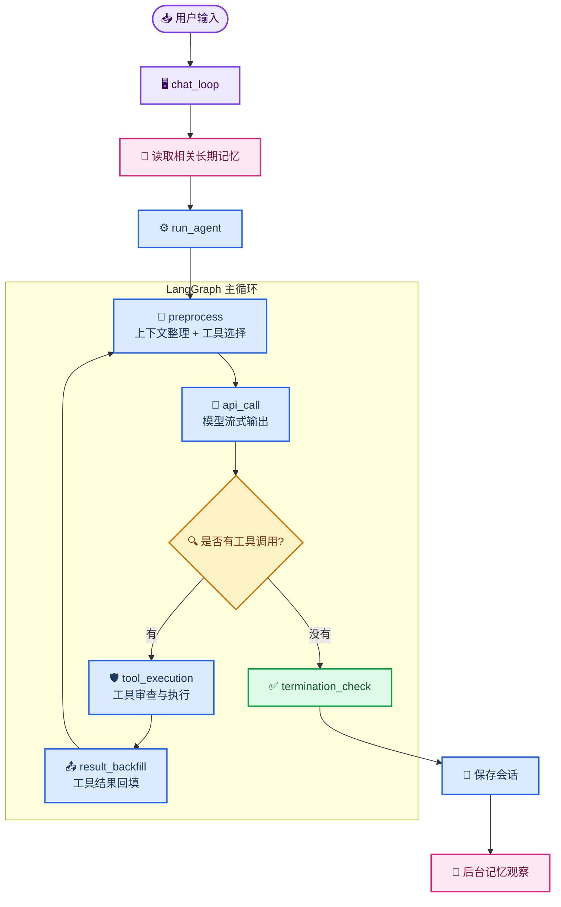

# code_agent

_从零开始搭建的本地 Python Coding Agent：按周记录一个 Agent 从最小循环长成 LangGraph、工具系统、上下文管理和长期记忆。_

<p align="center">
  
</p>

<p align="center">
  <a href="https://github.com/Anorlx/code_agent"></a>
  
  
  
</p>

## 🧭 这个仓库是什么

`code_agent` 是一个本地 terminal coding agent 的成长记录。它不是一次性写完的完整框架，而是按 `week1/day*`、`week2/day*` 保存每个阶段的代码：先做异步对话循环，再加入工具选择、权限审查、LangGraph 主循环、长期记忆、会话历史、上下文压缩，最后把 terminal 体验和记忆写入逻辑继续打磨。

根目录的 README 是整个仓库的总入口；每个阶段自己的细节说明保留在对应目录里。

## 🗺️ 演进路线

| 阶段 | 核心变化 | 入口 |
| --- | --- | --- |
| Week 1 Day 1 | 最小异步 Agent 循环、流式输出、基础工具目录 | `week1/day1` |
| Week 1 Day 2 | 加入 `run_command` 和 `permission_review`，把命令执行放进审查管线 | `week1/day2` |
| Week 1 Day 3 | 主循环迁移到 LangGraph，并加入 Markdown 长期记忆 | `week1/day3` |
| Week 1 Day 4 | 加入上下文管理、SQLite 会话历史、Sub Agent 短上下文 | `week1/day4` |
| Week 1 Day 5 | 优化 terminal UI：会话选择、状态行、工具事件、帮助命令 | `week1/day5` |
| Week 2 Day 1 | 重做记忆写入：每轮后台观察、互斥写入、TTL 和显著性衰减 | `week2/day1` |
| Week 2 Day 2 | 加入交互式权限确认：schema 校验、规则匹配、上下文审查之后进入用户确认 | `week2/day2` |

## 🧠 当前主线理解

当前版本可以拆成三条清晰的线：

- **主 Agent 线**：`chat_loop` 收到用户输入，加载相关记忆，然后把任务交给 `run_agent`
- **图执行线**：LangGraph 在 `preprocess -> api_call -> tool_execution -> result_backfill` 之间循环，直到没有工具调用
- **支撑系统线**：工具权限、会话保存、记忆检索/写入、上下文压缩都在主循环外侧支撑长期运行

<p align="center">
  
</p>

## 🔁 一轮对话怎么跑



## ✨ 模块分工

| 模块 | 它解决的问题 | 关键文件 |
| --- | --- | --- |
| Terminal 层 | 用户输入、会话选择、流式事件展示、权限确认、退出前等待后台任务 | `week2/day2/agent/main_agent/cli.py`, `week2/day2/agent/main_agent/terminal_ui.py` |
| LangGraph 主循环 | 把 Agent 状态拆成可路由节点，避免所有逻辑堆在一个 `while` | `week2/day2/agent/main_agent/graph.py` |
| 工具选择 | 根据当前问题和工具目录，决定本轮暴露哪些工具给主模型 | `week2/day2/agent/sub_agent/tool_search.py`, `week2/day2/agent/tools/README.md` |
| 工具执行 | 构造子 Agent 短上下文、校验 schema、审查权限、必要时请求用户确认、并发执行只读工具 | `week2/day2/agent/sub_agent/tool_runner.py`, `week2/day2/agent/sub_agent/permission_review.py` |
| 工具注册表 | 统一管理工具 schema、执行函数、并发安全和审查要求 | `week2/day2/agent/tools/registry.py` |
| 上下文管理 | Snip、MicroCompact、Collapse、AutoCompact，减少旧工具结果占用 | `week2/day2/agent/main_agent/context_manager.py` |
| 长期记忆 | 只保存不可低成本推导的信息，并支持 TTL、score、冲突覆盖 | `week2/day2/agent/memory_system/store.py`, `week2/day2/agent/memory_system/observer.py` |
| 会话历史 | SQLite 保存完整 messages，并用摘要帮助下次选择会话 | `week2/day2/agent/main_agent/session_store.py`, `week2/day2/agent/sub_agent/session_summarizer.py` |
| 模型适配 | DashScope OpenAI-compatible 流式输出，合并 tool call fragments | `week2/day2/agent/main_agent/model_client.py` |

## 🚀 快速开始

```bash
git clone https://github.com/Anorlx/code_agent.git
cd code_agent/week2/day2
export DASHSCOPE_API_KEY="你的 DashScope API Key"
python3 main.py
```

如果你想看某一天的实现，就进入对应目录运行。当前最新阶段是 `week2/day2`。

> 说明：这个仓库按学习过程保存阶段代码。不同 day 的依赖和模型默认值可能不同，建议优先从最新目录开始看。

## 🧪 终端体验

运行后会先选择会话，然后进入 `code_agent>`。一次任务里你可以看到这些事件：

```text
state / tools ls_project,read_project_file
tool_call read_project_file path=agent/main_agent/graph.py
review read_project_file allow risk=low
tool_done read_project_file path=agent/main_agent/graph.py
token dashscope_usage in=... out=... total=...
context micro_compact freed≈...
```

这些事件不是装饰，它们对应真实的运行边界：主图状态、工具调用、权限审查、工具结果、模型 token 用量和上下文清理。

## 🛡️ 最新权限确认管线

Week 2 Day 2 把工具执行前的安全路径拆成四步：

1. `validateInput`：根据工具 schema 检查必需字段、类型和枚举值
2. `hasPermissionsToUseTool`：读取工具配置，处理 `deny` 和 `requires_review`
3. `checkPermissions`：由 `permission_review` 子 Agent 根据短上下文判断风险
4. `interactivePrompt`：当结果是 `ask` 时，把决定权交还给 terminal 用户

这样一来，参数不合法、规则要求确认、上下文风险较高这三类情况都会走同一条路径：不静默执行，也不让主模型自己硬猜。

## 📌 设计取向

- **本地优先**：会话、记忆、日志和工具工作区都在项目本地
- **主循环清晰**：LangGraph 只处理状态流转，工具执行和权限判断下沉到子 Agent
- **记忆克制**：只保存无法从代码、文件或 Git 重新推导的信息
- **可观察**：每一步都尽量通过 terminal 事件暴露出来
- **按阶段沉淀**：每个 day 都能单独回看当时的设计选择
